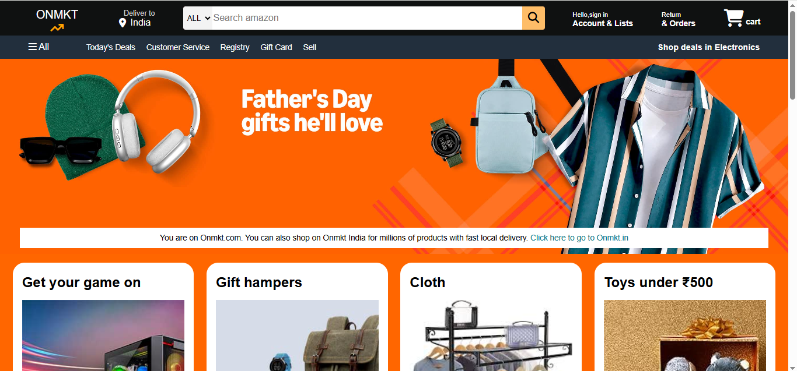

# 🛒 Amazon Clone

This is a responsive front-end clone of the Amazon homepage built using HTML and CSS with vanilla.js. It mimics the design and layout of the original Amazon website for learning purposes.

## 📸 Screenshots

 <!-- replace with actual image if available -->

## 💻 Tech Stack

- HTML5
- CSS3
- Flexbox
- Media Queries (if used)
- [Optional: JavaScript] (for interactions)

## ✨ Features

- Responsive navigation bar
- Hover effects on buttons and cards
- Custom search bar layout
- Product category sections
- Footer with links (similar to Amazon)
- Smooth scroll behavior

## 🚀 Getting Started

1. Clone the repo

```bash
git clone https://github.com/your-username/amazon-clone.git
